

<h1 align="center">InternSavy (Android App Development)</h1>

## Table of Contents

&nbsp;

- [About me](#about-me)

- [Features](#features)

- [Screenshots](#screenshots)

- [Credits](#credits)

&nbsp; &nbsp;

## About me

&nbsp;

Hey there! I am Alex, a computer science major at Addis Ababa University and a fellow Flutter
developer with over 7 months of experience. I have previously worked on personal projects, including
a note-taking app and a property management app for my local church.

This has been an excellent month spent on this project, which provided me with a valuable learning
experience. I got to explore features that were previously unknown to me. I am grateful for the
opportunity to work on this project and hope to continue working with InternSavy in the future.

&nbsp;

## Features

&nbsp;

- This is a 5-in-1 app. It has 5 different apps that are all accessible from the home screen.
- I have tried my best to make minimal usage of external packages.
- I have created separate branches in this repo during implementation phase for what I considered to
  be major tasks (milestones).
- In the home screen, you will find cards for the 5 apps together with brief descriptions on actual
  implementation that I have opted to use by flipping the card to its back.
- I have added localizations for languages: English, Indian (Hindi), Russian, and Amharic except for
  the descriptions behind the cards.
- It might take a little while when loading the screenshots in this readme file.
- I still consider myself a junior developer, with a big room for improvement! If you encounter any
  bugs, report them to me through @alexanderkalema@gmail.com.
- Lastly, make sure to run command "flutter pub get" to get the dependencies, Enjoy !!

&nbsp;

## Screenshots

&nbsp;

### Introduction Screens

&nbsp;

- First as you open the app for the first time, you will be greeted with an introduction screen

  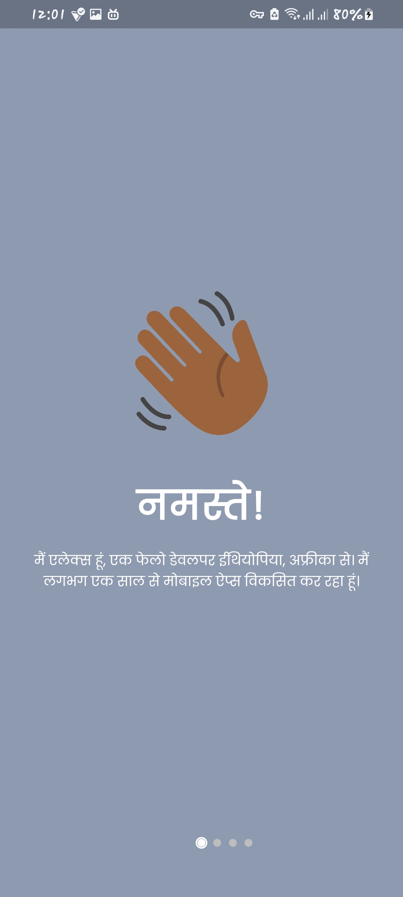
  
  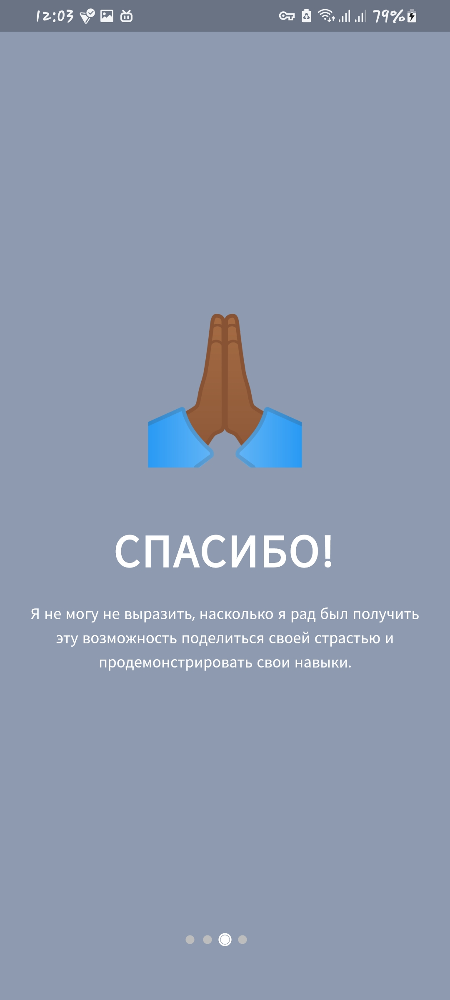
  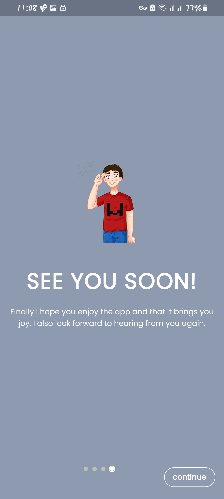

&nbsp;

### Home Screen

&nbsp;

- The landing page or home screen uses auto_route to direct you to your desired app destination,
  Cards can be flipped to get more information.

  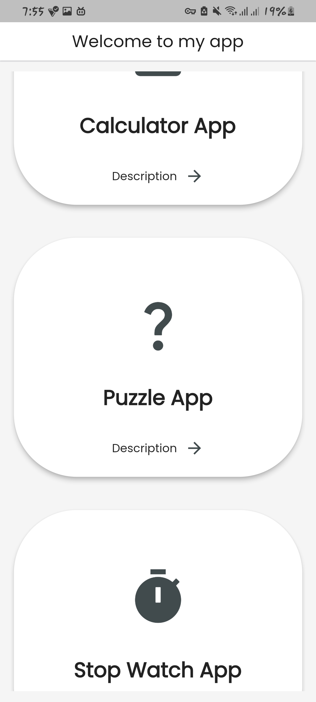
  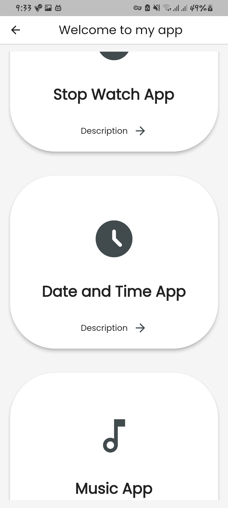
  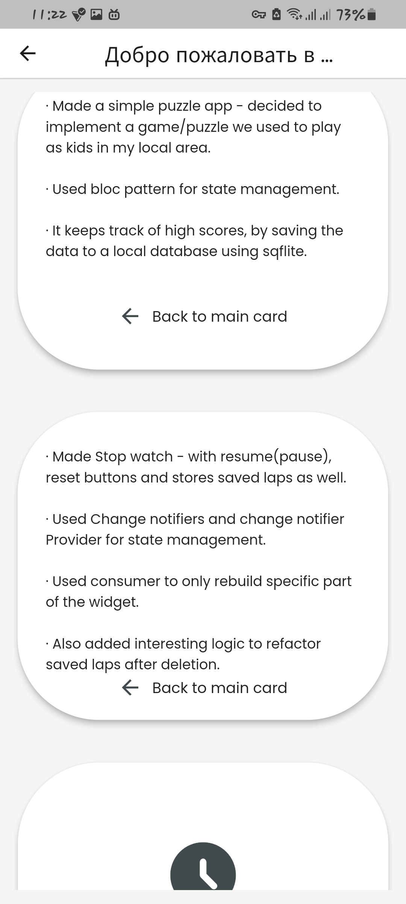

### Calculator App

&nbsp;

- The first app is a calculator app of 2 versions: simple and scientific calculator

&nbsp;

  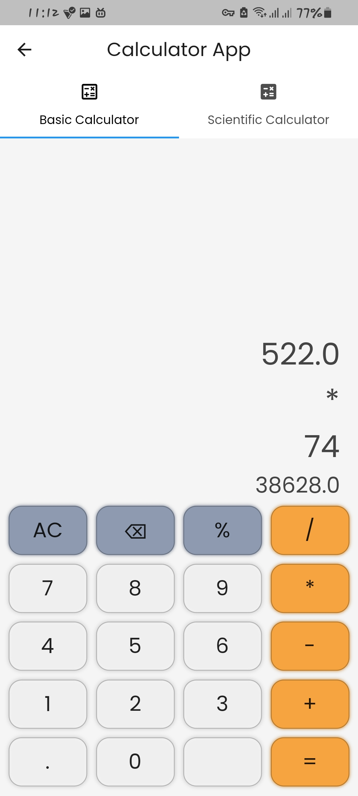
  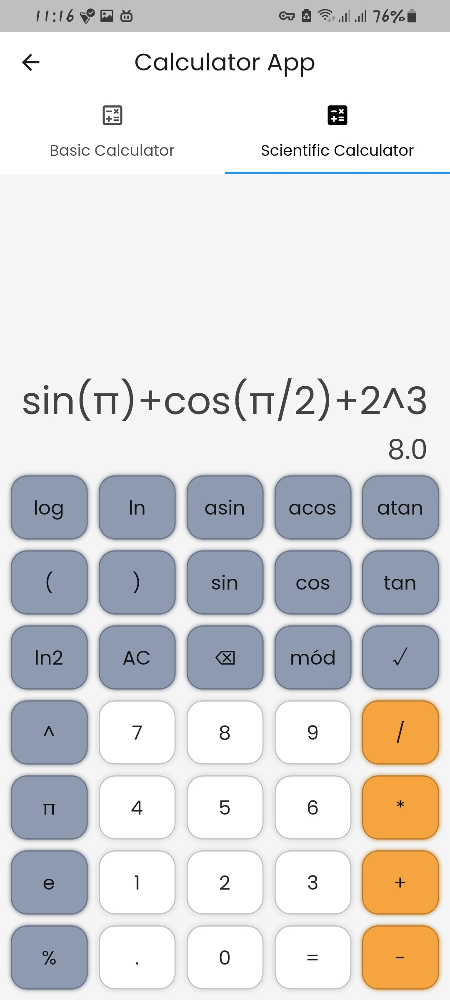

### Puzzle App

&nbsp;

- The second app is a puzzle app I used to play as a kid in my local area that has rules explained
  at first run ,and also previous tabs to help come up with better guess and high score tab.

&nbsp;

  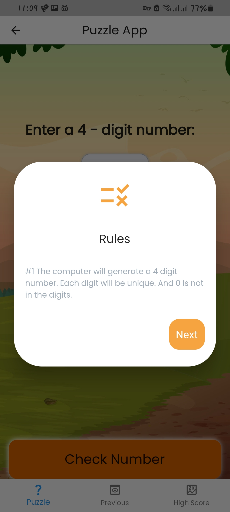
  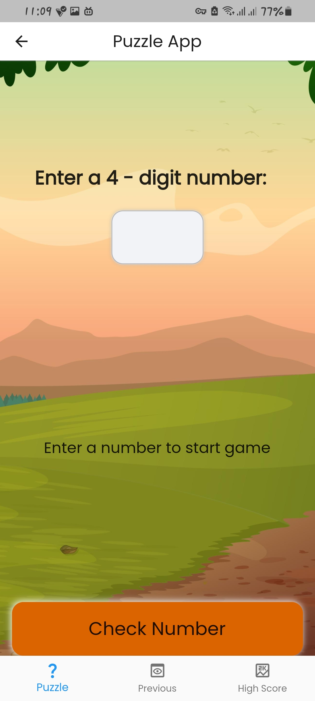
  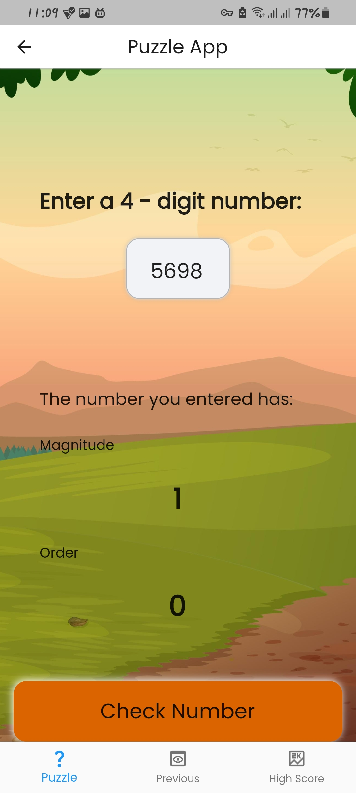
  
  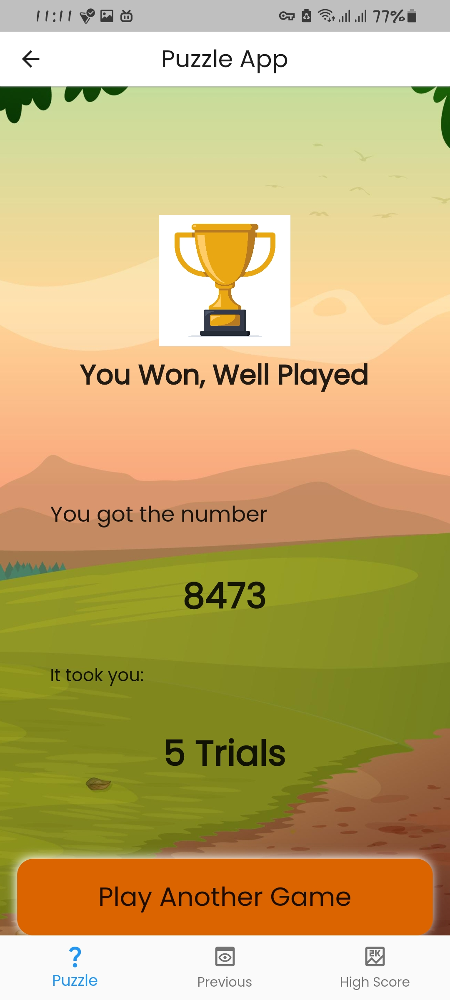
  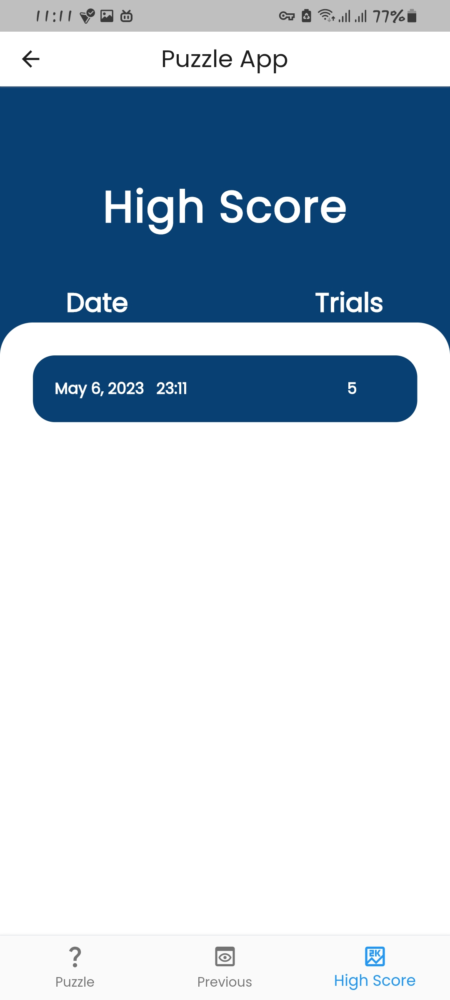

### Stopwatch App

&nbsp;

- The third app is a stop watch app with respective buttons and saved laps table

  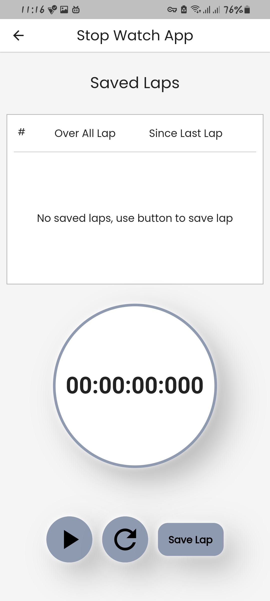
  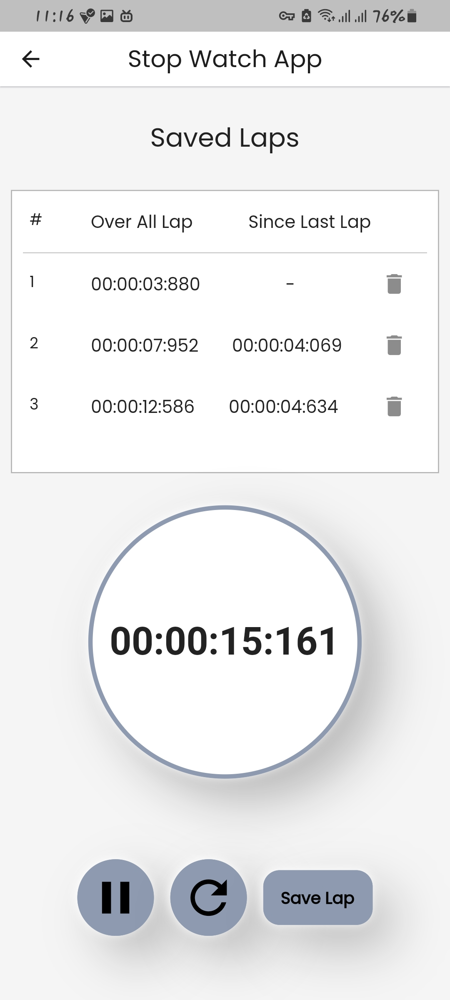

&nbsp;

### Date and Time App

&nbsp;

- The fourth app is a date and time app with options to switch from and to an analog/ digital clock.

  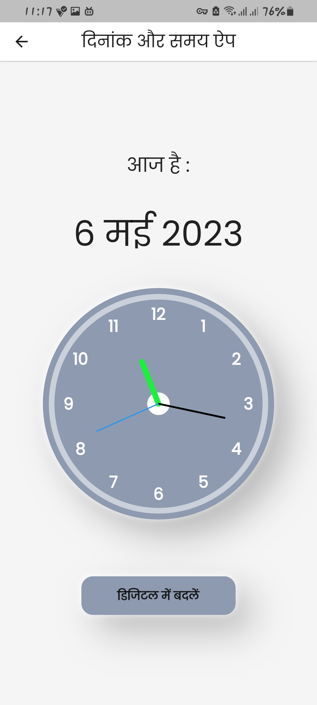
  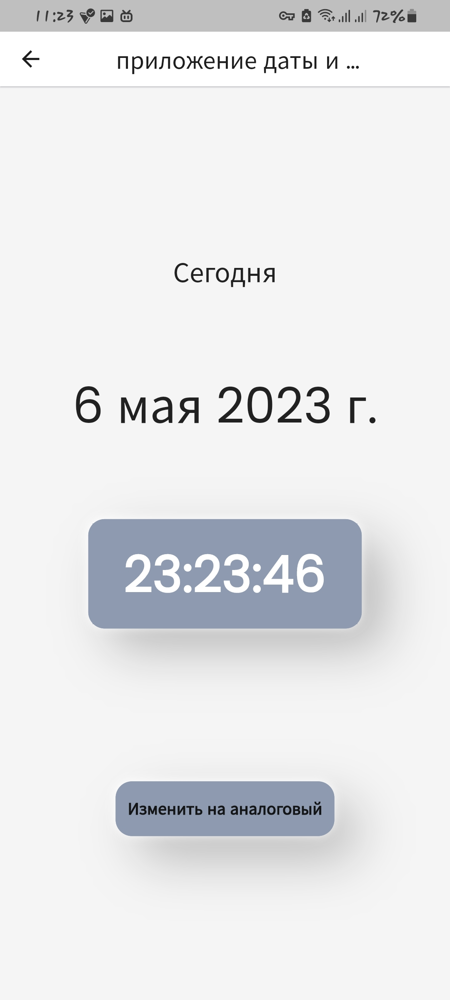

&nbsp;

### Music App

&nbsp;

- The last but not lest app is a music app that asks permission to read music files from phone , and
  plays them.

  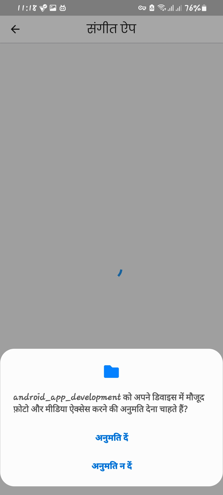
  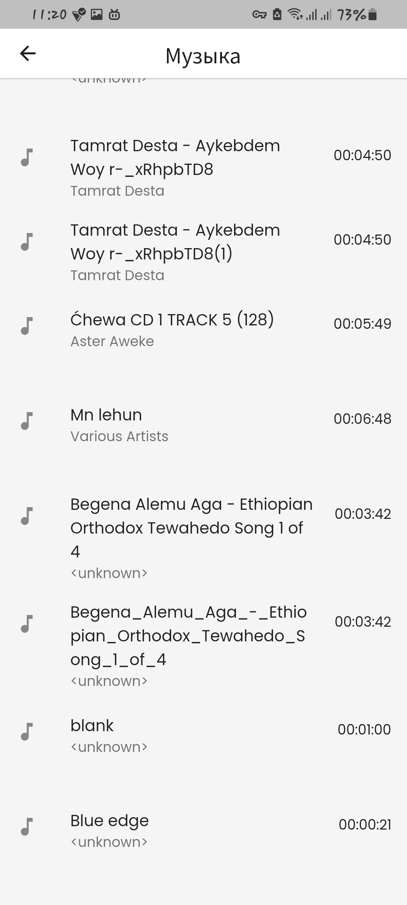
  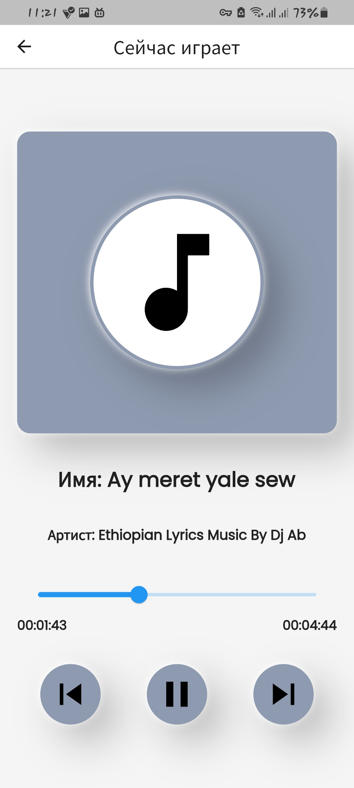

&nbsp;

## Credits

&nbsp;

- Image credits:

  <a href="https://www.freepik.com/free-vector/trophy_34295225.htm#query=cartoon%20trophy&position=1&from_view=keyword&track=ais">Image by juicy_fish</a>  
  <a href="http://www.freepik.com">Designed by brgfx / Freepik</a>  
  <a href="http://www.freepik.com">Designed by 0melapics / Freepik</a>  
  https://favpng.com/png_view/emoji-emoji-wave-human-skin-color-hand-waving-png/EdASSfSK  
  https://www.clipartmax.com/png/full/180-1808568_%C2%A0-birthday-party.png  
https://favpng.com/png_view/emoji-thumb-praying-hands-emoji-prayer-human-skin-color-png/3XfB2wY5  
https://www.nicepng.com/png/full/40-407701_strong-arm-png.png

